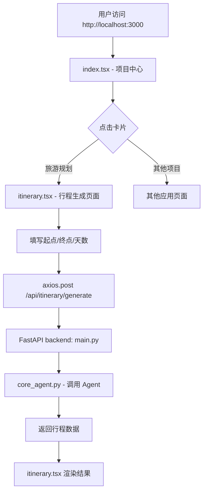

# Travel Planner - 项目结构总览

## 📁 目录树

```
travel-planner/
├── backend/                  # FastAPI 后端
│   ├── main.py              # API 入口文件 ✨
│   ├── requirements.txt     # Python 依赖
│   ├── agents/             # AI Agent 模块
│   │   ├── __init__.py
│   │   ├── core_agent.py    # 核心 Agent: RoutePlanner, ItineraryBuilder, CostEstimator
│   │   └── route_planner.py # 路线优化算法
│   ├── api/                # API endpoints (待扩展)
│   ├── database/           # 数据库层 (SQLite → PostgreSQL)
│   └── services/           # 第三方 API 集成
│       ├── google_places.py (TODO)
│       └── maps_api.py     (TODO)
│
├── frontend/               # Next.js 前端
│   ├── package.json        # Node 依赖
│   ├── tsconfig.json       # TypeScript 配置
│   ├── next.config.js      # Next.js 配置
│   ├── tailwind.config.js  # Tailwind CSS 配置
│   ├── postcss.config.js   # PostCSS 配置
│   ├── pages/              # Next.js Pages Router
│   │   ├── index.tsx       # 项目中心导航页 ✨
│   │   ├── itinerary.tsx   # 旅游规划主界面 ✨
│   │   └── _app.tsx        # 全局应用组件
│   ├── components/         # React 组件 (可扩展)
│   ├── hooks/              # 自定义 Hooks
│   ├── services/           # API 服务层
│   └── app/                # App Router (可选，当前使用 Pages)
│       └── globals.css     # 全局样式
│
├── docs/                   # 文档 (待创建)
├── README.md               # 项目说明 ✨
└── QUICKSTART.md           # 快速启动指南 ✨
```

## 🔑 核心文件说明

### Backend
- **`backend/main.py`**: FastAPI 应用入口，包含 CORS 配置、路由定义、Pydantic 模型
- **`backend/agents/core_agent.py`**: 三大核心 Agent（路线规划、行程构建、费用估算）
- **`backend/agents/route_planner.py`**: 城市距离计算与路径优化算法

### Frontend  
- **`frontend/pages/index.tsx`**: 项目中心导航页面（4 个项目的选择入口）
- **`frontend/pages/itinerary.tsx`**: 旅游规划主界面（输入表单 + 结果展示）
- **`frontend/pages/_app.tsx`**: 全局布局组件，加载 Tailwind CSS

## 🚦 执行流程



## 🎨 UI 架构设计原则

1. **极简 Apple 风** - 干净简洁，白色背景 + 渐变卡片
2. **暗色文字可见** - 所有文字确保清晰可读
3. **渐变色卡片** - 每个项目用不同颜色区分
4. **响应式布局** - Grid + Flexbox 适配移动端
5. **动画明显** - Hover 时 scale + shadow 过渡

## 🔧 开发工具链

| 技术栈 | 用途 | 版本 |
|--------|------|------|
| FastAPI | 后端框架 | 0.109.0 |
| Next.js 14 | 前端框架 | ^14.0.0 |
| Tailwind CSS | 样式库 | ^3.4.0 |
| TypeScript | 类型系统 | ^5.0.0 |
| Axios | HTTP 客户端 | ^1.6.0 |
| Pydantic | 数据验证 | ^2.5.3 |

## ⏭️ Phase 2 任务清单

- [ ] 安装 `crewai` 多 Agent 框架
- [ ] 接入 Google Places API (获取真实 POI 数据)
- [ ] Mapbox GL JS 地图可视化集成
- [ ] PDF 导出功能 (jspdf + react-pdf)
- [ ] User authentication (Clerk 或 NextAuth)
- [ ] 云端存储 (Supabase 或 Convex)

## 💾 数据存储方案 (未来)

### 当前：内存存储
```python
itineraries = {}  # journey_id → ItineraryResponse
```

### 目标：PostgreSQL
```sql
CREATE TABLE journeys (
    id UUID PRIMARY KEY DEFAULT gen_random_uuid(),
    start_city VARCHAR(100),
    end_city VARCHAR(100),
    days INTEGER,
    budget_per_day DECIMAL(10,2),
    interests JSONB,
    created_at TIMESTAMP DEFAULT NOW()
);

CREATE TABLE daily_plans (
    id UUID PRIMARY KEY DEFAULT gen_random_uuid(),
    journey_id UUID REFERENCES journeys(id),
    day_number INTEGER,
    activities JSONB,
    total_cost DECIMAL(10,2)
);
```

---

**最后更新**: 2026-08-11  
**作者**: Hermes Agent (基于 GitHub 高星项目分析)
